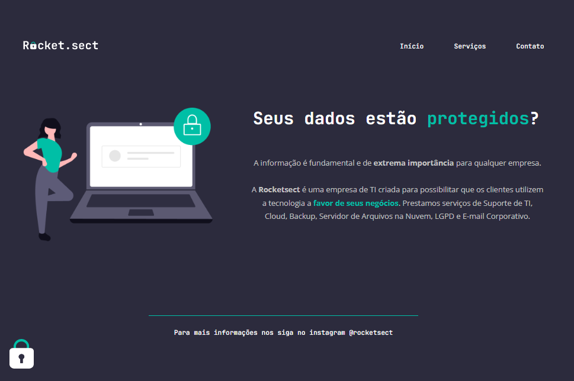

# Explorer - Projeto 03

> Projeto 03

Projeto desenvolvido durante o curso Explorer da Rocketseat, no último desafio do módulo Conhecendo Novos Conceitos de HTML e CSS. Nesse desafio era preciso recriar um layout utilizando o que foi aprendido no curso.

[Clique aqui para acessar](https://henriquetho.github.io/projeto03-explorer/)

## Tecnologias

    - HTML
    - CSS

## Contato

- henrique.ribeirotho@gmail.com
- [LinkedIn](https://www.linkedin.com/in/henrique-thomazin-068922162/)
